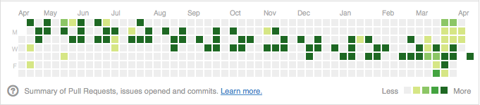

Profile Life
============

Github profile page hack to display a glider moving across my contribution
timeline.

Inspired by https://github.com/will/githubprofilecheat2

WTF?
====

GitHub has a neat display of historical activity on each user's profile page.
This 53x7 grid shows the number of commits and other GitHub interactions that
the user performed on each day for the last year. Each cell in the graph is
shaded with one of 5 possible colors. These colors correspond to the quartiles
of the normal distribution over the range `[0, max(v)]` where `v` is (issues
opened + pull requests proposed + commits authored) per day.

If your all time high for the last year was 100 contributions in a single day,
the cells would color like this:

| Contributions   | Color                         |
| :-------------- | :---------------------------- |
| 0               |  |
| 1  - 24         |  |
| 25 - 49         |  |
| 50 - 74         |  |
| 75+             |  |

This script will create a commit history in a repository to "game" this graph
to display a user specified pattern.

Currently the patterns generated are fairly simple. The script reads a file in
the form of a [plaintext Life file][] and outputs a list of shell commands
that will populate a git repository with 23 empty commits for the day
corresponding with a cell that is populated with an `O` character.

Usage
=====

    $ ./bin/pattern-to-commits.sh patterns/glider.cells 2012-04-15
    $ git push

[plaintext Life file]: http://www.conwaylife.com/wiki/Plaintext
